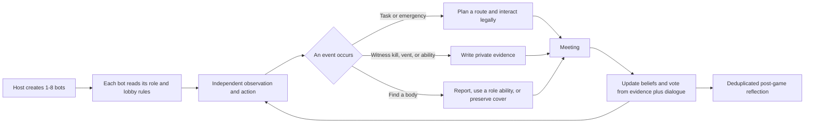

# Among Us DeepBot

> Turn empty local-lobby slots into independent players that move, observe, deceive, discuss, vote, and learn from failed rounds.

[](https://github.com/shimiaoshui/among-us-deepbot/releases/latest)
[](#requirements)
[](#)
[](#the-other-roles-460-integration)
[](#privacy-and-api-keys)

**Among Us DeepBot** is a host-authoritative AI player plugin for Among Us local and LAN lobbies. The host can configure between `1` and `8` bots in the lobby. Each bot joins as a real network player, while movement, decisions, and synchronization remain under host control. Human players, bots, and compatible clients can therefore play in the same match.

Current release: `0.9.10-tor46-strict-role-rules`. It includes a standalone build for the base game and a localized The Other Roles v4.6.0 integration build.

## More than an auto-walking bot

| Area | DeepBot behavior |
|---|---|
| Navigation | Plans multiple routes on The Skeld, avoids walls, table corners, and narrow entrances, and replans when movement stalls. |
| Tasks and crises | Follows the lobby task settings, completes valid tasks, handles lights, communications, oxygen, and reactor emergencies, and switches to the other panel when one side is already occupied. |
| Private perception | Each bot remembers only what it personally saw or heard. Bots do not share an omniscient team memory. |
| Meetings | Combines personal events, body locations, public claims, contradictions, and role evidence before speaking or voting. |
| Faction strategy | Crewmates work and evade danger; impostors fake tasks, create isolation, sabotage, hunt, and leave crime scenes; neutral roles pursue their own win conditions. |
| Role abilities | Every action is checked against lobby options, cooldowns, range, state, and TOR rules before the bot may use it. |
| Post-game learning | Bots summarize decisive mistakes after a match and store only new, reusable lessons in a local evolution record. |

## What happens during a match



DeepBot does not force every bot to play an identical optimal strategy. Personality affects work rate, risk tolerance, trust in testimony, speaking style, and vote thresholds. One bot may rush tasks, another may wander or follow a trusted player, one may trust only eyewitness evidence, and another may be persuaded by a credible account.

## Highlights in 0.9.10

- Host-created bots synchronize to clients without duplicating bots or stealing a human player's camera and controls.
- Vampire bites resolve after the configured delay without teleporting the Vampire to the victim.
- Bombs, traps, Bait, handcuffs, reversed controls, vents, and emergencies now cover host-owned virtual bots while remaining subject to TOR validation.
- Witnessed kills, vents, bomb or portal placement, vent sealing, invisibility, and morphing enter private memory and influence later meetings.
- The meeting parser distinguishes supportive role reads from accusations, suppresses generic filler, and preserves evidence-backed votes when the language model has no useful conclusion.
- The task bar counts only crew tasks that TOR considers eligible. Neutral and impostor players do not occupy crew task shares, while eligible crew ghosts can continue tasks.
- Kill cooldown, impostor count, task counts, role configuration, and bot count all follow the actual lobby settings.
- Impostors can open with fake tasks, then switch between roaming, shadowing, sabotage, hunting, and escape as conditions change.

## The Other Roles 4.6.0 integration

The compatibility layer recognizes all `44` custom primary roles, `2` base-game identities, and `11` stackable modifiers in TOR 4.6.0: `57/57` audited entries with `missing=0` and `extra=0`.

- Primary roles and modifiers remain separate. A valid combination such as Jackal plus a control modifier can coexist, but two mutually exclusive primary roles cannot be assigned together by DeepBot.
- Sheriff, Deputy, Arsonist, Vulture, Vampire, Bomber, Trapper, and other active roles have distinct objectives, eligibility checks, and results.
- Lovers, Bait, Bloody, reversed controls, and other modifiers constrain movement, murder, voting, and target selection.
- TOR remains authoritative for final win resolution and low-level ability legality. DeepBot chooses among legal actions; it does not replace or bypass TOR's rule engine.

See the [complete TOR 4.6.0 role coverage matrix](docs/TOR-4.6.0-全职业覆盖.md) for the current automation depth of each role.

## Downloads and quick start

Open [GitHub Releases](https://github.com/shimiaoshui/among-us-deepbot/releases/latest) and choose one package:

- `AmongUs-DeepBot-0.9.10-Standalone.zip`: base Among Us with BepInEx 6.
- `AmongUs-DeepBot-0.9.10-TOR46-Strict-Rules.zip`: strict TOR 4.6.0 integration. Every human player in the same lobby must install the identical compatibility package.

Basic installation:

1. Back up the current Among Us directory.
2. Extract the selected package into the game root.
3. Run `Install-DeepBot.cmd`. For model-backed meetings, run `Configure-DeepBot-Key.cmd` once and enter your own API key.
4. Let the host create a local or LAN lobby, select the bot count in TOR settings, and start the game.
5. Clients must use the same game, BepInEx, TOR, and DeepBot versions as the host.

The [complete Chinese user guide](docs/完整使用教程.md) covers host/client installation, version checks, upgrades, rollback, and troubleshooting. Verify downloaded files against `SHA256SUMS.txt` from the Release page.

## Requirements

- The Windows edition of Among Us.
- A matching game version and BepInEx 6 IL2CPP environment.
- The TOR package requires every participant to use the same TOR 4.6.0 compatibility build.
- The model endpoint provides high-level meeting and action suggestions. Navigation, cooldowns, ability legality, and critical fallback behavior remain local and deterministic.

## Privacy and API keys

The repository and release archives contain **no API key**. The configuration script stores a user's own key under that Windows user's local application-data directory; it is never written into the plugin DLL, Git repository, or redistribution archives. Without a key, bots continue to use local fallback behavior, although meeting language and high-level situational decisions become more conservative.

## Building from source

Let BepInEx generate interop assemblies for the target game version, then run:

```powershell
dotnet build .\src\AmongUsDeepSeekBots.csproj -c Release /p:AmongUsDir="D:\steam\steamapps\common\Among Us"
```

`AmongUsDir` must point to a directory containing `Among Us.exe`, `BepInEx\core`, and `BepInEx\interop`. The modified The Other Roles source, GPLv3 license, and third-party notices are published alongside the TOR integration package.

## Project status

DeepBot is an actively developed experimental game-AI project. The current focus is The Skeld and TOR 4.6.0. Complex mod combinations, different game builds, and extreme network conditions may still expose edge cases. Useful bug reports include `BepInEx\LogOutput.log`, lobby settings, role assignments, and exact reproduction steps.

Project website: [shimiaoshui.xyz/deepbot](https://shimiaoshui.xyz/deepbot)
