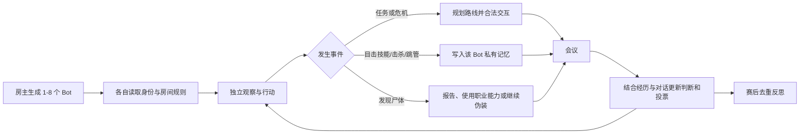

# Among Us DeepBot

> 让本地房间里的空位，变成会行动、会观察、会撒谎、会讨论，也会犯错和复盘的独立玩家。

[](https://github.com/shimiaoshui/among-us-deepbot/releases/latest)
[](#运行条件)
[](#)
[](#the-other-roles-460-兼容)
[](#隐私与-api-密钥)

**Among Us DeepBot** 是一个面向 Among Us 本地/LAN 房间的房主权威 AI Bot 插件。房主可以在等待房间中设置 `1–8` 个 Bot；它们会作为真正的网络玩家加入，由房主统一计算和同步，能够与人类玩家、其他 Bot 以及安装同版本插件的客端共同游戏。

当前版本：`0.9.10-tor46-strict-role-rules`，同时提供原版构建与 The Other Roles v4.6.0 汉化兼容构建。

## 它和普通“自动走路 Bot”有什么不同？

| 能力 | DeepBot 的处理方式 |
|---|---|
| 地图行动 | 在 The Skeld 上规划多条可行路线，绕开墙体、桌角与狭窄入口，并在卡住时重新选路。 |
| 任务与危机 | 按房间任务配置做任务；处理照明、通讯、氧气和反应堆，并会根据现场已有人处理的一侧改去另一侧。 |
| 私有视角 | 每个 Bot 只记录自己实际看到或听到的事情，不共享“全知上帝视角”。 |
| 会议讨论 | 把个人经历、尸体位置、玩家发言、矛盾与职业能力证据带入讨论和投票。 |
| 阵营策略 | 船员完成任务并避险；内鬼会假任务、制造落单机会、选择破坏和撤离路线；中立职业围绕自己的胜利条件行动。 |
| 职业技能 | 技能先经过房间设置、冷却、距离、状态与 TOR 规则校验，再由情境决策选择是否使用。 |
| 持续学习 | 对局结束后总结关键失败原因；仅把不重复、可复用的经验写入本机 Bot 进化记录。 |

## 一局游戏里会发生什么



Bot 并不保证每次作出“最优解”。不同性格会影响勤奋程度、冒险倾向、对传闻的信任、发言语气和投票阈值：有的急着清任务，有的会闲逛或跟人；有的只信亲眼证据，有的更容易被可信说法改变判断。

## 0.9.10 重点改进

- 房主创建并同步 DeepBot，客端不重复生成，也不会把相机或操作权切换到 Bot。
- 吸血鬼咬人按设置延迟结算，被害者延迟死亡；吸血鬼不再瞬移补刀。
- 炸弹、陷阱、诱饵、手铐、反向操作、跳管与紧急任务覆盖房主虚拟 Bot，并继续服从 TOR 的合法性判定。
- Bot 亲眼看到击杀、跳管、放置炸弹/传送门/摄像头、封管、隐身和变形等动作后，会写入私有记忆并带入后续会议。
- 会议能区分“可能是船员/好人/可信”等正向表述与真正指控；没有新信息时不再反复说套话。
- 任务条只统计符合 TOR 规则的船员任务，中立与内鬼不占船员任务份额；灵魂船员仍可继续完成任务。
- 击杀冷却、内鬼数量、任务数量、职业配置与 `AI Bot 数量` 均以实际等待房间设置为准。
- 内鬼开局可先做假任务掩护，并在条件改变时切换为游荡、尾随、破坏、猎杀或撤离。

## The Other Roles 4.6.0 兼容

兼容层识别 TOR 4.6.0 的 `44` 个自定义主职业、`2` 个原版基础身份和 `11` 种可叠加附加职业，共 `57/57` 项，审计结果为 `missing=0`、`extra=0`。

- 主职业和附加职业分开处理：例如“豺狼 + 反向操作”可以共存，但两个互斥主职业不会错误叠加。
- 警长、副警长、纵火犯、秃鹫、吸血鬼、炸弹客、陷阱师等主动能力有独立目标、条件和结果规则。
- 恋人、诱饵、血迹、反向操作等附加规则会约束移动、击杀、投票和队友选择。
- TOR 继续负责最终胜负判定与技能底层合法性；DeepBot 负责在合法动作中观察、推理和决策，不绕过模组规则。

完整清单和当前自动化深度见 [TOR 4.6.0 全职业覆盖](docs/TOR-4.6.0-全职业覆盖.md)。

## 下载与快速开始

前往 [GitHub Releases](https://github.com/shimiaoshui/among-us-deepbot/releases/latest)，选择一种版本：

- `AmongUs-DeepBot-0.9.10-Standalone.zip`：原版 Among Us + BepInEx 6。
- `AmongUs-DeepBot-0.9.10-TOR46-Strict-Rules.zip`：TOR 4.6.0 汉化兼容严格规则版；同一房间的所有真人玩家必须安装同一份兼容包。

基本流程：

1. 备份现有 Among Us 目录。
2. 将所选压缩包解压到游戏根目录。
3. 运行 `Install-DeepBot.cmd`；需要联网会议时，再运行 `Configure-DeepBot-Key.cmd` 设置自己的 API 密钥。
4. 由房主创建本地/LAN 房间，在 TOR 设置中选择 `AI Bot 数量`，再开始游戏。
5. 客端使用与房主完全相同的游戏、BepInEx、TOR 与 DeepBot 版本加入。

更完整的房主/客端安装、校验、升级、还原和故障排查步骤见 [完整使用教程](docs/完整使用教程.md)。下载后可用 Release 中的 `SHA256SUMS.txt` 校验文件完整性。

## 运行条件

- Windows 版 Among Us。
- 与发布包匹配的游戏版本和 BepInEx 6 IL2CPP 环境。
- TOR 兼容版要求所有参与者使用同一份 TOR 4.6.0 兼容构建。
- AI 语言接口仅用于高层会议/行为建议；寻路、冷却、技能合法性和关键后备行为仍由本地规则控制。

## 隐私与 API 密钥

仓库和发布包**不包含任何 API 密钥**。配置脚本只会把用户自己的密钥保存到当前 Windows 用户的本地应用数据目录，不写入插件 DLL、Git 仓库或分享包。没有密钥时，Bot 仍可使用本地后备逻辑完成基本游戏，但会议语言和高层情境决策会更保守。

## 从源码构建

先让 BepInEx 为目标游戏版本生成 `interop` 文件，然后执行：

```powershell
dotnet build .\src\AmongUsDeepSeekBots.csproj -c Release /p:AmongUsDir="D:\steam\steamapps\common\Among Us"
```

`AmongUsDir` 必须指向含 `Among Us.exe`、`BepInEx\core` 和 `BepInEx\interop` 的目录。TOR 兼容版对 The Other Roles 的修改源码、GPLv3 许可证与第三方声明随同 Release 提供。

## 项目状态

这是仍在迭代的实验性游戏 AI 项目。当前重点是 The Skeld 与 TOR 4.6.0：复杂模组组合、不同游戏版本和极端网络条件仍可能出现边缘问题。提交问题时请附上 `BepInEx\LogOutput.log`、房间设置、身份组合和复现步骤，它们比单独一张截图更有助于定位根因。

项目主页：[shimiaoshui.xyz/deepbot](https://shimiaoshui.xyz/deepbot)
