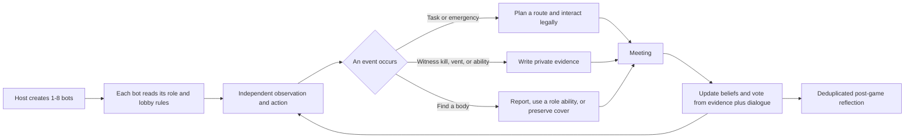

# Among Us DeepBot

> Turn empty local-lobby slots into independent players that move, observe, deceive, discuss, vote, and learn from failed rounds.

[](https://github.com/shimiaoshui/among-us-deepbot/releases/latest)
[](#requirements)
[](#)
[](#the-other-roles-460-integration)
[](#privacy-and-api-keys)

**Among Us DeepBot** is a host-authoritative AI player plugin for Among Us local and LAN lobbies. The host can configure between `1` and `8` bots in the lobby. Each bot joins as a real network player, while movement, decisions, and synchronization remain under host control. Human players, bots, and compatible clients can therefore play in the same match.

Current release: `0.10.5-client-sync`. It ships separate one-click host and client installers for one fingerprinted TOR 4.6.0 compatibility build.

## More than an auto-walking bot

| Area | DeepBot behavior |
|---|---|
| Navigation | Plans multiple routes on The Skeld, avoids walls, table corners, and narrow entrances, and replans when movement stalls. |
| Tasks and crises | Follows the lobby task settings, completes valid tasks, handles lights, communications, oxygen, and reactor emergencies, and switches to the other panel when one side is already occupied. |
| Private perception | Each bot remembers only what it personally saw or heard. Bots do not share an omniscient team memory. |
| Meetings | Combines personal events, body locations, public claims, contradictions, and role evidence before speaking or voting. |
| Faction strategy | Crewmates work and evade danger; impostors fake tasks, create isolation, sabotage, hunt, and leave crime scenes; neutral roles pursue their own win conditions. |
| Role abilities | Every action is checked against lobby options, cooldowns, range, state, and TOR rules before the bot may use it. |
| Post-game learning | Bots summarize decisive mistakes after a match and store only new, reusable lessons in a local evolution record. |

## What happens during a match


```mermaid
flowchart LR
    A[Host creates 1-8 bots] --> B[Each bot reads its role and lobby rules]
    B --> C[Independent observation and action]
    C --> D{An event occurs}
    D -->|Task or emergency| E[Plan a route and interact legally]
    D -->|Witness kill, vent, or ability| F[Write private evidence]
    D -->|Find a body| G[Report, use a role ability, or preserve cover]
    E --> H[Meeting]
    F --> H
    G --> H
    H --> I[Update beliefs and vote from evidence plus dialogue]
    I --> C
    I --> J[Deduplicated post-game reflection]
```

DeepBot does not force every bot to play an identical optimal strategy. Personality affects work rate, risk tolerance, trust in testimony, speaking style, and vote thresholds. One bot may rush tasks, another may wander or follow a trusted player, one may trust only eyewitness evidence, and another may be persuaded by a credible account.

## Highlights in 0.10.5

- The GitHub release is now published through the normal Latest channel, so the main download page no longer serves the obsolete 0.10.3 client.
- Interactive installs always create a mode-specific guarded shortcut. Before launch it shows the exact Host/Client mode, release, and game directory, preventing Steam from silently opening another Among Us copy.
- Client installation and launch both enforce `BotCount = 0`; a client can never create local bots before joining the real host.
- Startup logs include the loaded plugin version, game root, and active configuration path. A remote log can now prove immediately whether the correct installation is running.

- Passive LAN clients reconstruct presentation-only entries for the host's reserved virtual bot clients and bind them to the host-spawned network players, so bots appear and move from authoritative host state.
- The client presentation path executes before the strict authority return; every decision, movement, ability, role-state, meeting, and camera subsystem remains host-only.
- Stable bot identity and idempotent lobby appearance updates prevent both human-input mirroring and the name-change RPC flood that caused heartbeat disconnects.
- New client diagnostics expose the exact reserved-record/control/proxy counts needed to validate a LAN join without leaking private bot information.

The release retains all authority and installer work from 0.10.3:

- Passive LAN clients are stopped at the runtime authority boundary before any movement, role, camera, meeting, memory, or world-control subsystem can run. Only the host may drive bots, preventing bots from mirroring a client's local player input.
- Selecting a Steam library now prefers the actively used TOR + DeepBot installation and its recent runtime log over an unrelated vanilla folder merely named `Among Us`.
- The installer and uninstaller share the same target-selection rules. Automated packaging tests cover a Steam library containing both a vanilla installation and a separate active TOR installation.
- TOR's native Local/LAN version handshake is retried once per second as soon as a local player exists. The retry still uses TOR's own version and module GUID checks and does not accept incompatible builds.
- Host and Client packages carry the same TOR, Reactor, and DeepBot fingerprints; the guarded launcher rejects a mixed installation before starting the game.
- TOR placement abilities now use the runtime grid's reachable projected endpoint instead of an obstructed room-center transform. This removes the repeated Storage fuel/crate-corner loop seen with Trickster box placement.

The release retains all installation and LAN work from 0.10.2:

- Local/LAN clients retry TOR's native version handshake while they are in the lobby. This fixes the race that could show “The host has no or a different version of The Other Roles” and remove a matching client.
- TOR's native version and module checks remain authoritative; the fix does not disable incompatible-version protection.
- Every Host and Client payload carries a compatibility manifest. The installer and launcher verify the exact TOR, Reactor, and DeepBot SHA-256 fingerprints before the game starts.
- The Host installer includes masked fields for the OpenAI-compatible API base URL and API key. The key is written only to the current Windows user's local application-data folder and never to the game directory, installer receipt, log, source, or release archive.
- Host and Client installers now include the private CoreCLR runtime required by BepInEx IL2CPP on a clean computer.
- The installer verifies the complete Doorstop, CoreCLR, BepInEx, Reactor, TOR, DeepBot, configuration, and launcher chain before reporting success.
- The desktop shortcut now runs a guarded launcher. If Steam validation or another tool removes a required mod file, it reports the missing component instead of silently opening vanilla Among Us.

The release retains all gameplay changes from 0.10.0:

- Separate self-contained Windows installers configure the host and passive LAN clients from a selected Steam folder. Existing mod files are backed up before replacement.
- Living bots no longer receive an unvalidated side-step when every avoidance direction is blocked, preventing corner escape from pushing a bot outside the hull.
- Ninja, Chameleon, and base-game Phantom concealment now feed the same observer-aware perception gate. Hidden players are not exposed through bot prompts, pursuit targets, private memories, or witnessed-action records, while TOR's native teammate visibility rules remain intact.
- Known allies may retain TOR-authorized teammate visibility, but a final local meeting guard prevents bots from naming an ally's secret ability, using an ally as a trial accusation, or voting for a protected teammate/client/partner.
- Meetings continuously re-check native vote completion and detect TOR ghost roles, preventing a completed vote from freezing the round after a later meeting.
- Vampire is excluded from every ordinary-kill pursuit entry point and uses the native TOR bite sequence: the victim dies at the original position after the configured delay.
- Multi-stage role decisions keep TOR's native sequence authoritative while allowing a new tactical decision at legal checkpoints for Morphling, Trickster, Ninja, Warlock, Vampire, Bomber, and Yoyo.
- Security Guard camera or DoorLog information, Detective footprints, Seer souls, base-game shapeshifts, and client vent entries enter the correct bot's private memory.
- Speaker-attribution guards prevent bots from inventing lines that the addressed player never said. Unsupported meeting filler is suppressed instead of being presented as evidence.

The release retains the lobby identity and evidence-isolation work introduced in 0.9.11:

- The TOR lobby settings now configure each of up to eight bots independently: display name, color, outfit, and nameplate.
- Bot identity is tied to reserved virtual-client ownership instead of the visible `DeepBot N` prefix. Renaming a bot no longer disables movement, tasks, meetings, abilities, camera isolation, or TOR interactions.
- Duplicate configured names are disambiguated deterministically, such as `Echo` and `Echo 6`, so overlapping role labels cannot make two players look like one player with multiple primary roles.
- Meeting prompts isolate each bot's private timeline from every other bot. Public chat remains hearsay unless the receiving bot personally witnessed the event.
- Unsupported claims such as asking for another player's "murder route" are rewritten into an honest suspicion or a direct eyewitness accusation only when that bot actually witnessed the kill.
- Bot-to-bot messages no longer recursively trigger every bot to call the model again. A bot reconsiders another bot's line only when directly addressed or when its current vote candidate is discussed; human statements still update every bot's beliefs and vote.
- Secret impostor kill details cannot be presented as public corpse locations, timing, routes, or eyewitness facts until the same information has been disclosed publicly.

The release also retains the strict TOR rule integration introduced in 0.9.10:

- Host-created bots synchronize to clients without duplicating bots or stealing a human player's camera and controls.
- Vampire bites resolve after the configured delay without teleporting the Vampire to the victim.
- Bombs, traps, Bait, handcuffs, reversed controls, vents, and emergencies now cover host-owned virtual bots while remaining subject to TOR validation.
- Witnessed kills, vents, bomb or portal placement, vent sealing, invisibility, and morphing enter private memory and influence later meetings.
- The meeting parser distinguishes supportive role reads from accusations, suppresses generic filler, and preserves evidence-backed votes when the language model has no useful conclusion.
- The task bar counts only crew tasks that TOR considers eligible. Neutral and impostor players do not occupy crew task shares, while eligible crew ghosts can continue tasks.
- Kill cooldown, impostor count, task counts, role configuration, and bot count all follow the actual lobby settings.
- Impostors can open with fake tasks, then switch between roaming, shadowing, sabotage, hunting, and escape as conditions change.

## The Other Roles 4.6.0 integration

The compatibility layer recognizes all `44` custom primary roles, `2` base-game identities, and `11` stackable modifiers in TOR 4.6.0: `57/57` audited entries with `missing=0` and `extra=0`.

- Primary roles and modifiers remain separate. A valid combination such as Jackal plus a control modifier can coexist, but two mutually exclusive primary roles cannot be assigned together by DeepBot.
- Sheriff, Deputy, Arsonist, Vulture, Vampire, Bomber, Trapper, and other active roles have distinct objectives, eligibility checks, and results.
- Lovers, Bait, Bloody, reversed controls, and other modifiers constrain movement, murder, voting, and target selection.
- TOR remains authoritative for final win resolution and low-level ability legality. DeepBot chooses among legal actions; it does not replace or bypass TOR's rule engine.

See the [complete TOR 4.6.0 role coverage matrix](docs/TOR_ROLE_COVERAGE.md) for the current automation depth of each role.

## Downloads and quick start

Open [GitHub Releases](https://github.com/shimiaoshui/among-us-deepbot/releases/latest) and choose one installer:

- `AmongUs-DeepBot-Host-Installer.exe`: for the player who creates the Local/LAN lobby and controls the bots.
- `AmongUs-DeepBot-Client-Installer.exe`: for every other human player; it installs the matching passive client configuration and never creates bots.
- `AmongUs-DeepBot-Host-Uninstaller.exe`: removes a recorded host installation and restores files that existed before installation.
- `AmongUs-DeepBot-Client-Uninstaller.exe`: removes a recorded client installation and restores files that existed before installation.

Basic installation:

1. Close Among Us and run the correct installer.
2. Select the Steam root, for example `D:\steam\`, or the exact folder containing `Among Us.exe`.
3. The host enters the API base URL and API key directly in the Host installer. `Configure-DeepBot-Key.cmd` remains available for later key changes.
4. The host creates a Local/LAN lobby, selects the bot count in TOR settings, and starts the game.
5. Clients use the client installer from the same Release version.

The matching uninstaller accepts the same Steam root or exact game directory. It uses the install receipt and SHA-256 hashes to restore overwritten files, delete only files installed by that package, and preserve files changed after installation.

The [complete English user guide](docs/USER_GUIDE.md) covers host/client installation, version checks, upgrades, rollback, and troubleshooting. Verify downloaded files against `SHA256SUMS.txt` from the Release page.

## Requirements

- The Windows edition of Among Us.
- A matching game version and BepInEx 6 IL2CPP environment.
- The TOR package requires every participant to use the same TOR 4.6.0 compatibility build.
- The model endpoint provides high-level meeting and action suggestions. Navigation, cooldowns, ability legality, and critical fallback behavior remain local and deterministic.

## Privacy and API keys

The repository and release archives contain **no API key**. The Host installer and configuration script store a user's own key under that Windows user's local application-data directory; it is never written into the game directory, installer receipt, installer log, plugin DLL, Git repository, or redistribution archives. Without a key, bots continue to use local fallback behavior, although meeting language and high-level situational decisions become more conservative.

## Building from source

Let BepInEx generate interop assemblies for the target game version, then run:

```powershell
dotnet build .\src\AmongUsDeepSeekBots.csproj -c Release /p:AmongUsDir="D:\steam\steamapps\common\Among Us"
```

`AmongUsDir` must point to a directory containing `Among Us.exe`, `BepInEx\core`, and `BepInEx\interop`. The modified The Other Roles source, GPLv3 license, and third-party notices are published alongside the TOR integration package.

## Project status

DeepBot is an actively developed experimental game-AI project. The Skeld and TOR 4.6.0 are the release-qualified target. MIRA HQ remains experimental and is not claimed as complete in this release. Complex mod combinations, different game builds, and extreme network conditions may still expose edge cases. Useful bug reports include `BepInEx\LogOutput.log`, lobby settings, role assignments, and exact reproduction steps.

Project website: [shimiaoshui.xyz/deepbot](https://shimiaoshui.xyz/deepbot)
